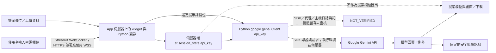

# BYOK Security & Privacy QA — 2026-10-08

## 固定版本與路徑：土庫驛 AI 行銷企劃工作台

基準 commit：`c49c4b41c14683c9f152003c3636caa18ac42611`。以下行號指向此基準，不是修改後行號。

| 邊界 | 已驗證程式路徑 |
|---|---|
| 輸入／儲存 | [app.py L172–190](https://github.com/ericpwa/tukuyi-ai-marketing-app/blob/c49c4b41c14683c9f152003c3636caa18ac42611/app.py#L172)：password widget → 原始輸入值存 `session_state.api_key` → 自動驗證 |
| 初始化 | [app.py L88–100](https://github.com/ericpwa/tukuyi-ai-marketing-app/blob/c49c4b41c14683c9f152003c3636caa18ac42611/app.py#L88)：SDK 前移除空白／引號／反引號；`genai.Client(api_key=clean_key)` |
| 驗證／探索 | [app.py L102–148](https://github.com/ericpwa/tukuyi-ai-marketing-app/blob/c49c4b41c14683c9f152003c3636caa18ac42611/app.py#L102)：先 `models.list()`，找到模型即可判 valid；否則最多 4 模型 `PING`。探索成功不等於正式生成成功 |
| 正式生成 | [app.py L637–654](https://github.com/ericpwa/tukuyi-ai-marketing-app/blob/c49c4b41c14683c9f152003c3636caa18ac42611/app.py#L637)：非模擬且 valid 時，單次 `generate_content` 傳提案名稱／受眾／產業／預算與固定要求；失敗改模擬摘要 |
| 錯誤到 UI | L99、144 → L188；L650–651 生成警告、L791–793 檔案解析錯誤原本直接顯示例外 |
| 下載 | [app.py L662–759](https://github.com/ericpwa/tukuyi-ai-marketing-app/blob/c49c4b41c14683c9f152003c3636caa18ac42611/app.py#L662)：明列 `proposal_result` → current_proposal → Markdown/JSON/HTML/PPTX，不含 auth state。JSON helper 會原樣包入傳入資料，不是通用 allowlist |
| 磁碟 | [app.py L748–759](https://github.com/ericpwa/tukuyi-ai-marketing-app/blob/c49c4b41c14683c9f152003c3636caa18ac42611/app.py#L748) 原本所有會話共用 `output_proposal.pptx`；[generate_pptx.py L342–343](https://github.com/ericpwa/tukuyi-ai-marketing-app/blob/c49c4b41c14683c9f152003c3636caa18ac42611/generate_pptx.py#L342) 寫檔並印路徑，不是印 Key |

額外風險：高 P1，PPTX 共用檔名有「A 寫檔 → B 覆寫 → A 讀到 B 提案」競態，沒有證據顯示實際事故。PR 已改每次渲染的 `io.BytesIO`；下載用 `.getvalue()`，不再讀寫共用檔案。離線執行下載片段驗證兩個獨立 buffer；真正 python-pptx 生成與多使用者伺服器測試 NOT_VERIFIED。

其他待處理：
- 中 P2：`generate_standalone_html_deck` 把部分使用者／模型欄位直接插入 HTML，未做通用 HTML escaping；惡意內容可能在下載頁面執行，未證實可讀 App 金鑰。本次不重構 HTML renderer，勿把未審查的 HTML 當可信文件分享。
- 低 P3：清空金鑰會切回模擬，但 `api_key_valid` 可能保留舊值；SDK 仍使用目前（已清空）的 key，不是舊 key，API 無法初始化時由安全訊息處理。建議後續以 widget 生命週期測試修正狀態重置。
- 切換模擬不自動清除金鑰；已在 UI 告知。模擬內部提案處理仍在 App 伺服器，不等於離線瀏覽器。

## 證據邊界

本次為 2026-10-08 原始碼及離線 QA，沒有使用真實金鑰、呼叫 Google、安裝套件、合併或部署。沒有證據顯示真實 API Key 已外洩。
測試使用明示無效的 synthetic canary；用 AST 執行實際 Python 函式、錯誤顯示與下載片段，SDK／Streamlit 顯示介面由替身取代並封鎖 socket。這不是完整瀏覽器或 SDK 整合測試。

`PASS_OFFLINE_SCOPED` 僅指指定應用程式邊界測試；`HUMAN_REVIEW` 尚待審查，不能視為 production acceptance。

## 共同資料流



密碼遮罩只遮蔽輸入畫面。金鑰仍存在瀏覽器 widget、網路傳輸、伺服器 Python 字串、session 與 SDK 物件中。
目前程式沒有指定自訂 `base_url`；依 SDK 預設走 Gemini Developer API，通常為 `generativelanguage.googleapis.com`。實際部署的 SDK 版本、環境變數、代理與網路端點／認證 header 未封包驗證，不能宣稱絕無中介。
沒有使用 `st.cache_data`／`st.cache_resource` 儲存金鑰或 SDK client；未見將金鑰欄位寫入應用資料庫、檔案或程式日誌的路徑。這是程式碼範圍的觀察，不是全系統零留存保證。
清空輸入會更新目前 `api_key`；關頁／重整與會話生命週期也不能保證 Python 字串、舊 SDK 物件、widget 副本或主機備份立即抹除。

## 共同風險與狀態

等級依影響及觸發條件評估，非 CVSS 或已發生事故判定。

| ID | 等級 | 證據與觸發條件 | 本次處理／剩餘風險 |
|---|---|---|---|
| R1 | 高 P1 | README/UI 將伺服器會話描述成純前端，影響使用者是否信任主機的決策 | 修正文件、金鑰旁告知與政策文字；伺服器架構保留 |
| R2 | 高 P1（條件式洩漏） | SDK 初始化／驗證／生成、檔案解析例外被直接字串化顯示；若例外含認證或輸入內容即外顯 | 改固定訊息；原始 SDK payload 不放入 `api_error` 或 UI；canary 修正前失敗、修正後通過。不能推論真實 SDK 曾回傳金鑰 |
| R3 | 高 P1（設定風險） | `.streamlit/config.toml` 明確 `enableCORS=false`、`enableXsrfProtection=false` | OPEN：未更動部署設定。部署前在隔離 staging 啟用二者，測跨來源連線、上傳與反向代理；無 exploit 或現場流量證據 |
| R4 | 中 P2 | 金鑰輸入後即自動驗證，模型備援會增加 API 呼叫 | 明確告知 API 配額／費用歸使用者專案；沒有費用硬上限或免費保證，保留既有驗證與備援 |
| R5 | 中 P2 | SDK、Streamlit 與第三方依賴採最低版本，沒有部署鎖定版本；外部日誌／代理未知 | NOT_VERIFIED：實機版本、環境設定、log sinks、APM、crash dumps、記憶體／備份政策待營運者查核 |
| R6 | 中 P2 | 一般文字欄位、模型回覆、上傳資料仍可含機密 | 告知先去識別化；匯出不是 DLP，若手動把 Key 放在提案欄位，仍可能送往模型／下載。未擅自改動業務 schema |

## 本次修正及相容性

- 不改提示詞內容、模型清單、正常生成流程、提案結構或依賴版本。
- 固定錯誤訊息犧牲原始錯誤細節；STP 已有 invalid-key／quota 類別仍保留。支援時只提供操作步驟、時間、模型、概略錯誤類別，不貼 Key 或完整 HTTP payload。
- 不新增遙測、外部儲存、付費服務或 Browser-only 架構。
- 未查核主機歷史日誌，不能判定需不需要撤銷既有 Key；使用者若有疑似外洩，應自行在 Google 撤銷／更換並檢查用量，勿傳送金鑰給支援人員。

## 可重跑的離線驗證

在本儲存庫執行（Python 標準函式庫，無安裝）：

```bash
python3 -m unittest test_byok_security -v
python3 test_suite.py
```

安全套件每個儲存庫 10 項：8 項適用並通過，2 項為另一 App 專用而跳過。
涵蓋 SDK 初始化含秘密的例外、驗證失敗、空白及包裹引號的金鑰、UI 錯誤 sink、實際匯出 payload 不含認證狀態，以及各自的模型備援／探索與 PPTX buffer 邊界。
`test_suite.py` 是既有案例／匯出／語法測試；STP 有 4 個檢查群組，土庫驛有 3 個。它們不是 live API 或瀏覽器驗收。

NOT_VERIFIED：真實 Gemini 成功／失敗、Google 帳戶配額、瀏覽器渲染、WebSocket 跨會話隔離、日誌與磁碟的實機取證、Streamlit Cloud 實際部署設定、native PowerPoint/Excel 開啟與視覺驗收。

## 另外評估的替代方案（未實作）

| 方案 | 安全邊界 | 費用與維運 | 相容性／工作量估計 |
|---|---|---|---|
| 保留已修正的伺服器端 BYOK | 必須信任 App 主機；先完成 R3/R5 | 現有主機可沿用；免費方案限制需另確認；API 不保證免費 | 最高相容性；這次 PR 的路線 |
| 個人本機 Streamlit | 金鑰只經使用者自己的 Python 主機與 Google，仍不是 Browser-only | 無新增雲端主機費；本機更新、依賴稽核及 API 用量由使用者負擔 | 既有功能最容易保留；於已備妥且經稽核環境執行 `streamlit run app.py --server.address 127.0.0.1` |
| 原生 HTML/CSS/JS 靜態 Browser-only BYOK | 使用者臨時輸入 Key，只放 JS 記憶體；瀏覽器直呼 Google；不送 App 後端 | 本機靜態服務或公開 GitHub Pages 可免主機費；API 費用仍依帳戶。自行維護安全與相容性 | 先移植一個生成流程、Markdown/JSON 匯出；Streamlit UI／Python SDK 需重寫，PPTX/XLSX 非直接相容；粗估單流程 1–2 人日、全功能數日至數週，非報價 |
| 無 Key 的離線模擬／提示詞手動工作流 | 不在 App 輸入 Key；複製非敏感提示詞到自己的模型介面 | 模擬 API 費用為零；外部模型服務條款與費用另計 | 土庫驛已有模擬模式；STP 目前有金鑰門禁，另案才更動。保留人工轉貼與檢查步驟 |

Browser-only 的可執行試作順序：
1. 新建獨立目錄／分支，只移植一個提示詞與 native `fetch` 呼叫；Key 放閉包記憶體，不放 `localStorage`、`sessionStorage`、URL、分析事件、service worker 或 repo。
2. 使用 Google 官方 REST endpoint，以 `x-goog-api-key` header 傳遞，避免 `?key=` query；先用本機假端點做離線格式測試。正式 CORS／preflight／金鑰限制及模型相容性需另行授權實機驗證，現在為 NOT_VERIFIED。
3. 不載第三方腳本或 CDN；嚴格 CSP、`textContent` 顯示模型／使用者內容、禁止任意 HTML 注入、限制連線目的地、明示清除記憶體按鈕及 revoke 流程。
4. DevTools 審查所有 request：Key 只應出現在對 Google 的認證 header，關頁後不應有 Web Storage／IndexedDB／cache 記錄；別把含 Key 的 HAR 當作公開證據。
5. 人工核准前先保留兩版並行。優先 Markdown/JSON 及瀏覽器列印；PPTX 要另做原生格式產生或經依賴 gate 審核的 JS 套件，不能宣稱零成本完整替換。

Browser-only 減少 App 伺服器接觸金鑰，但仍信任送到瀏覽器的 JavaScript、網站發布者、瀏覽器與擴充套件；XSS／供應鏈可讀取 Key。不能嵌入共用開發者金鑰。Google 官方建議正式應用把私密金鑰保留於後端，並非對任意 Browser-only BYOK 作全面安全背書。

## Rollback

審查 PR 不會改動預設分支。尚未合併：關閉 PR，保留基準 commit 與交付的 baseline ZIP 即可；不要 force-push 預設分支。
已合併時：另開 rollback 分支，squash merge 用 `git revert <squash-commit>`，merge commit 用 `git revert -m 1 <merge-commit>`；若 rebase merge，逐一反向 revert 該 PR 的 commit，再建立 PR 審查。部署仍需獨立授權。
回復舊版本會重新引入本報告列出的風險，應先停止對外處理敏感資料。PPTX 改用記憶體不會自動清除舊部署磁碟上的 `output_proposal.pptx`，需主機管理者依留存政策另行處置。

## 官方參考（2026-10-08 查閱）

- [Streamlit client/server architecture](https://docs.streamlit.io/develop/concepts/architecture/architecture)：Python 在伺服器執行，瀏覽器經 WebSocket 維持會話。
- [Streamlit Session State](https://docs.streamlit.io/develop/api-reference/caching-and-state/st.session_state)：會話生命週期不能視為安全抹除保證。
- [Streamlit config](https://docs.streamlit.io/develop/api-reference/configuration/config.toml)：CORS／XSRF 與部署設定。
- [Google Python GenAI SDK](https://googleapis.github.io/python-genai/)：API key 初始化、HTTP 設定與代理支援；本次沒有安裝或執行 SDK。
- [Google API key safety](https://ai.google.dev/gemini-api/docs/api-key?authuser=00)：金鑰限制、計費專案與避免公開內嵌 Key。
- [Google Gemini pricing](https://ai.google.dev/gemini-api/docs/pricing?hl=en) 與 [data terms](https://ai.google.dev/gemini-api/terms)：免費與付費方案的配額、資料使用條款有差異，亦可能依區域不同；不保證免費或零資料留存。
- [GitHub Pages availability](https://docs.github.com/en/pages/getting-started-with-github-pages/about-github-pages)：靜態 hosting；公開儲存庫可使用 GitHub Free 的 Pages。

- [python-pptx file-like saving](https://python-pptx.readthedocs.io/en/latest/user/presentations.html)：官方支援 BytesIO；本次只測 App 呼叫邊界，未以實際套件渲染。
