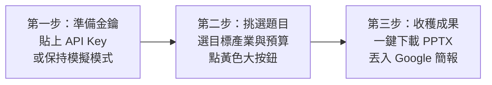

# 🍫 土庫驛可可莊園 (Tukuyi Cocoa) - AI 行銷企劃大師工作台 (v2.0 Enterprise)

> **系統所有權人 / 著作權人**：BOSS、院長、Eric 潘穩安博士 (Dr. Eric Wen-An Pan)  
> **專案定位**：《AI 應用於行銷企劃撰寫與簡報提案技巧》（6小時工作坊）企業專屬交付成果  
> **核心架構**：遵循 **BYOK (Bring Your Own Key) 零成本原則**，免付費啟動，支援 GitHub 與 Streamlit Community Cloud 一鍵雲端部署。

---

## ⚖️ 智財權與資安隱私宣告 (Intellectual Property & Security)

1. **所有權歸屬**：本系統架構、演算法模型、視覺主題樣式及提示詞工程資產，所有權與智財權完整歸屬於 **Eric 潘穩安博士**。
2. **授權使用**：僅授權土庫驛可可莊園企業內部教育訓練與日常企劃實務使用，未經書面許可，禁止任何第三人進行原始碼反向工程、盜用改作或商業轉售。
3. **純前端 Session 資安防護**：
   - 採用嚴格的「BYOK 客戶端隔離模式」，使用者輸入之 Google Gemini API Key 僅留存於當前瀏覽器 Session State 中，後端伺服器磁碟**絕不儲存、絕不上傳日誌**，完全杜絕金鑰洩漏風險。
   - 所有生成的企劃提案均附加 `SHA-256` 數位指紋防偽標記。

---

## 🐣 新手小白＆小學生 3 步驟極速上手指南

院長帶著你做，只要 3 個步驟，小學生也能產出米其林級的高奢提案：



### 第一步：打開開關（0 元免費模式）
- 看到網頁左邊側邊欄：如果你有從 Google AI Studio 申請的免費 Key，貼進去；**如果沒有，完全不用動，系統預設為「高擬真模擬模式」，直接可以使用！**

### 第二步：點選方案
- 點擊上方頁籤 **「🚀 CH05 聖誕禮盒企劃生成器」**。
- 挑選提案對象（例如：企業客戶提案 福委/總務/採購）、產業（例如：高科技半導體業）、預算階梯（例如：尊爵款 $999~$1,299）。
- 點擊金黃色按鈕 **「✨ 立即生成完整企劃案與簡報」**！

### 第三步：收穫成果與雙軌簡報使用
- 只要 3 秒鐘，網頁下方立刻為您呈現預估營收、銷售盒數、毛利率（57.2%）與完整企劃。
- 點擊 **「📊 下載 16:9 PPTX 簡報」**：
  - **在微軟 PowerPoint 開啟**：直接點兩下打開，享受深色奢華可可棕卡片美學。
  - **在 Google 簡報開啟**：打開您的 [Google 雲端硬碟 (Google Drive)](https://drive.google.com/)，把剛才下載的 `.pptx` 檔案直接拖拉進去，點兩下即可線上與團隊共同編輯！

---

## ☁️ 院長 GitHub 與 Streamlit Community Cloud 雲端部署手把手指南

本專案已完全完成雲端化配置（已配置 `.streamlit/config.toml`、`requirements.txt` 與 Git 倉庫），院長可隨時推送到個人 GitHub 帳號並完成雲端發布：

### 1. 將本機倉庫推送到院長的 GitHub
```bash
cd /Users/wenanpan/.gemini/antigravity/scratch/tukuyi-ai-marketing-app

# 1. 關聯到院長的 GitHub 倉庫 (請將 YOUR_GITHUB_USERNAME 替換為實際帳號)
git remote add origin https://github.com/YOUR_GITHUB_USERNAME/tukuyi-ai-marketing-app.git

# 2. 推送至 GitHub main 分支
git branch -M main
git push -u origin main
```

### 2. 在 Streamlit Community Cloud 啟動 0 元永久雲端部署
1. 前往 [Streamlit Community Cloud](https://share.streamlit.io/) 並以 GitHub 帳號登入。
2. 點選右上角的 **"New app"**。
3. 在 **Repository** 選擇剛才推送的 `tukuyi-ai-marketing-app`。
4. 在 **Main file path** 輸入 `app.py`。
5. 點擊 **"Deploy!"**！
6. **約 60 秒後，您將獲得一個專屬的公開 HTTPS 網址**（例如 `https://tukuyi-marketing.streamlit.app`），即可直接分享給土庫驛 7 位學員永久免費使用！

---

## ⚡ Gemini 模型動態容錯與除錯報告對齊

本工作台已深度整合「Gemini 模型升級除錯報告」與「AI Persona Designer App」的實戰經驗：
- **徹底杜絕 404 NOT_FOUND 錯誤**：嚴格移除過期或無效別名（如 `gemini-flash`），採用官方正名 `gemini-1.5-flash`、`gemini-2.0-flash`、`gemini-1.5-pro`。
- **動態模型探勘 (Dynamic Discovery)**：自動調用 `client.models.list()` 探索帳號可用的生成模型。
- **金鑰淨化防呆**：自動清除金鑰前後多餘空格、單雙引號及反引號 (`.strip().strip("'").strip('"').strip('`')`)。
- **雙軌備援機制**：若遇網路中斷或 API 額度限制，系統平滑降級至高擬真模擬引擎，絕不跳出突兀報錯中斷教學。

---

## 📁 檔案架構

```text
tukuyi-ai-marketing-app/
├── app.py                  # Streamlit 主程式 (所有權人宣告、導覽、Gemini 容錯引擎)
├── sample_data.py          # 土庫驛 CI/VI 規範、教學案例、受眾 Persona、CH01-03 多題型庫
├── export_helpers.py       # Markdown/JSON/HTML/CSV 多格式匯出與 SHA-256 防偽演算法
├── generate_pptx.py        # 原生 16:9 品牌 CI/VI PPTX 簡報生成引擎
├── style.css               # 土庫驛奢華巧克力大地色視覺主題樣式表
├── test_suite.py           # 自動化測試套件 (涵蓋資料完整性、匯出檢驗與語法檢查)
├── requirements.txt        # Python 雲端依賴套件清單
├── .streamlit/
│   └── config.toml         # 雲端伺服器與主題配色設定檔
├── .gitignore              # Git 版本控制忽略清單
└── README.md               # 專案手冊與小學生級操作指南
```

---
*本系統智慧財產權與專利由 BOSS / 院長 / Eric 潘穩安博士 嚴格所有*
